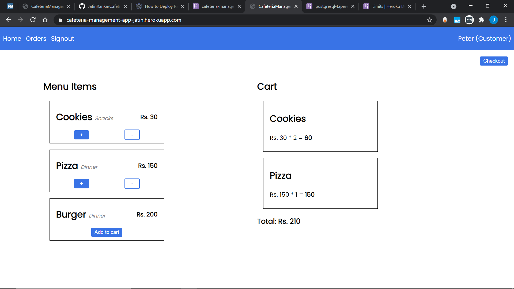
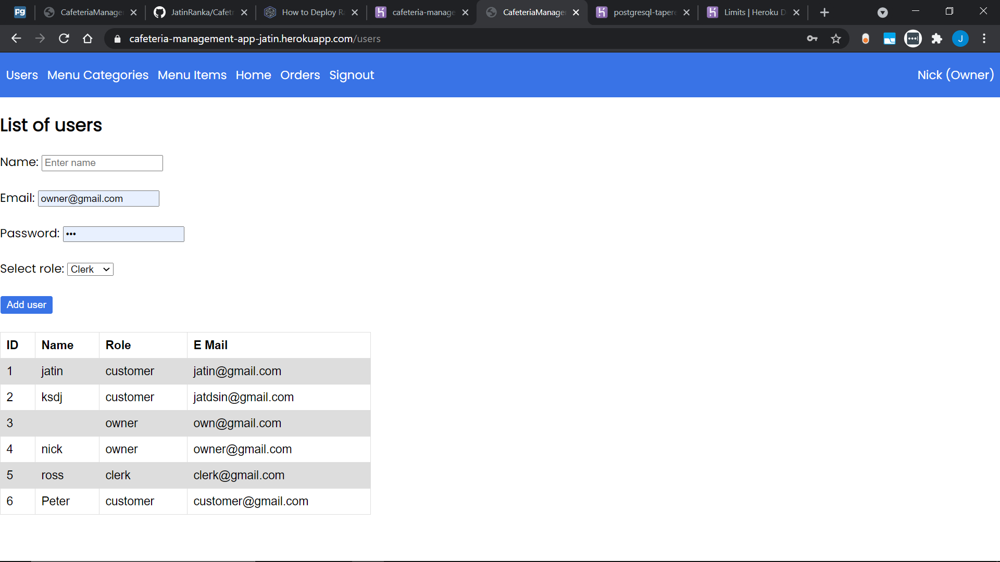
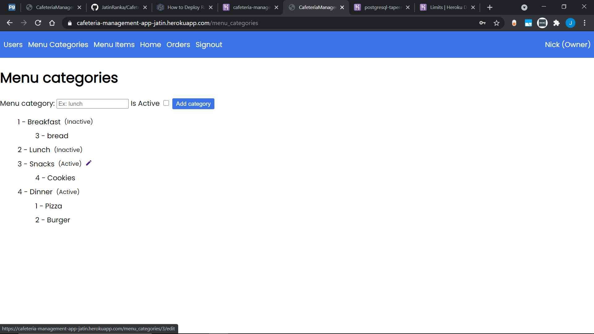

# Cafeteria Management System - Ruby on Rails

## Persona

There are three personas in Cafeteria system:

### Cafeteria Owner:

The owner has complete access of the system. He/she can add and update stock, create invoices, see all reports, add users.

### Online Customer:

A customer can place an order online. They can see the invoice details and status of their order only.

### Cafeteria Billing Clerk:

The billing clerk can update and place customer orders directly from the counter. They can create new invoices, and see order status.

## Credentails for demo:

| User Role | Email              | Password |
| --------- | ------------------ | -------- |
| Owner     | owner@gmail.com    | pwd      |
| Clerk     | clerk@gmail.com    | pwd      |
| Customer  | csutomer@gmail.com | pwd      |

## Screenshots

### Home page

### Users page

### Menu Categories page

